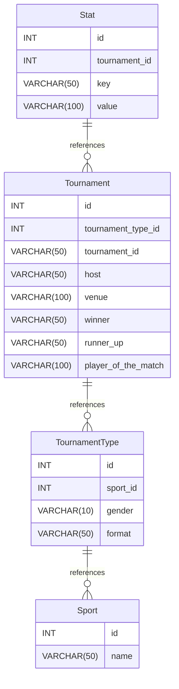

# sports-data-platform
A comprehensive sports data application built with FastAPI and MySQL, allowing for CRUD operations and data ingestion via CSV files

# ER Diagram

# ER Diagram documentation
## Summary

- [Introduction](#introduction)
- [Database Type](#database-type)
- [Table Structure](#table-structure)
	- [Sport](#Sport)
	- [TournamentType](#TournamentType)
	- [Tournament](#Tournament)
	- [Stat](#Stat)
- [Relationships](#relationships)
- [Database Diagram](#database-Diagram)

## Introduction

It is a database schema using SQLAlchemy for managing sports data. It organizes relationships between sports, tournament types, tournaments, and stats. Below is a breakdown of the classes and relationships

## Database type

- **Database system:** Generic : It is not designed for a specific application or domain. Instead, it provides a flexible framework that can be adapted to various data storage and retrieval needs.
## Table structure

### Sport

| Name        | Type          | Settings                      | References                    | Note                           |
|-------------|---------------|-------------------------------|-------------------------------|--------------------------------|
| **id** | INT | 🔑 PK, not null , unique, autoincrement |  |Primary Key |
| **name** | VARCHAR(50) | not null , unique |  | | 

### TournamentType

| Name        | Type          | Settings                      | References                    | Note                           |
|-------------|---------------|-------------------------------|-------------------------------|--------------------------------|
| **id** | INT | 🔑 PK, not null , unique, autoincrement |  | |
| **sport_id** | INT | not null  | Sport_id_fk | |
| **gender** | VARCHAR(10) | not null  |  | |
| **format** | VARCHAR(50) | not null  |  | | 

### Tournament

| Name        | Type          | Settings                      | References                    | Note                           |
|-------------|---------------|-------------------------------|-------------------------------|--------------------------------|
| **id** | INT | 🔑 PK, not null , unique, autoincrement |  | |
| **tournament_type_id** | INT | not null  | TournamentType_id_fk | |
| **tournament_id** | VARCHAR(50) | not null  |  | |
| **host** | VARCHAR(50) | not null  |  | |
| **venue** | VARCHAR(100) | not null  |  | |
| **winner** | VARCHAR(50) | not null  |  | |
| **runner_up** | VARCHAR(50) | not null  |  | |
| **player_of_the_match** | VARCHAR(100) | not null  |  | | 

### Stat

| Name        | Type          | Settings                      | References                    | Note                           |
|-------------|---------------|-------------------------------|-------------------------------|--------------------------------|
| **id** | INT | 🔑 PK, not null , unique, autoincrement |  | |
| **tournament_id** | INT | not null  | Tournament_id_fk | |
| **key** | VARCHAR(50) | not null  |  | |
| **value** | VARCHAR(100) | not null  |  | | 

## Relationships

- **TournamentType to Sport**: many_to_one
- **Tournament to TournamentType**: many_to_one
- **Stat to Tournament**: many_to_one

## Database Diagram

